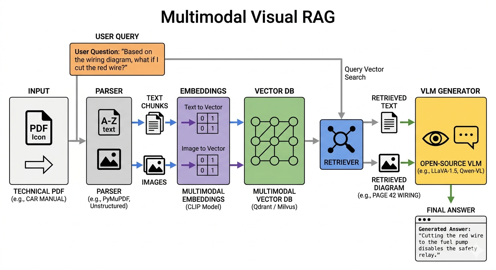

# Project: Multimodal RAG using VLM

## The Project: Multimodal RAG for Complex Technical Manuals

### The Problem
Normal chatbots and standard RAG systems can only read text. If you give them a 500-page engineering manual or a medical textbook, they completely ignore the diagrams, charts, and blueprints. This means they miss a significant portion of the critical context required to answer technical questions accurately.

### The Solution: "Visual RAG"
You will build a "Visual RAG" system. 

1. You upload a dense, complex PDF (like a car repair manual or a dataset of circuit board diagrams).
2. Your code parses the PDF, separating the text from the images, and stores both in a **Multimodal Vector Database**.
3. A user asks a question like, *"Based on the wiring diagram on page 42, what happens if I cut the red wire?"*
4. Your system searches the database, retrieves the exact diagram and the surrounding text, feeds both into an open-source **Vision-Language Model (VLM)**, and the VLM generates a perfectly accurate answer based on the visual context.

---

##  Architecture Overview

---

##  Phases of Implementation

### Phase 1: Environment & Architecture Planning
- **Understand the Data Flow:** PDF Input → Parser → [Text chunks + Images] → Embeddings → Vector DB → Query → Retriever → VLM → Answer
- **Set Up Environment:** Create a Python virtual environment. You'll need a PDF parser, an embedding model, a vector database client, and a VLM inference engine.

### Phase 2: PDF Parsing — Splitting Text from Images
- **Choose a Parser:** We use `PyMuPDF` (fitz) because it is highly reliable for extracting both text blocks and embedded images, while preserving page numbers and bounding boxes.
- **Contextual Extraction:** Extract text logically and tag it with metadata (e.g., page number). Extract images as files (PNG/JPEG) and tag them with their location.
- **Pro Tip:** Grab the text *surrounding* an image to use as its "context text." This significantly improves retrieval accuracy!

### Phase 3: Building the Embedding Pipeline
- **Text Embeddings:** Convert text chunks into vectors using a standard text embedding model (like `sentence-transformers/all-MiniLM-L6-v2`).
- **Image Embeddings (CLIP):** Use OpenAI's **CLIP** model. CLIP embeds both text and images into the *same vector space*. When a user asks about a "wiring diagram," CLIP's text encoder can match the text query to the image vector!

### Phase 4: Setting Up the Vector Database
- **Qdrant:** We use Qdrant, running locally via Docker, for storing vectors.
- **Dual Collections:** Create separate collections: `text_chunks` (for text embeddings) and `image_chunks` (for CLIP image embeddings), as they have different vector dimensions.

### Phase 5: The Retrieval Logic
- **Hybrid Retriever:** When a question is asked, run two parallel searches:
  1. Embed the query with the text model → search the `text_chunks` collection.
  2. Embed the query with CLIP's text encoder → search the `image_chunks` collection.
- **Assemble Context:** Retrieve the top results, merge them into a single context payload, and prepare it for the VLM.

### Phase 6: VLM Inference
- **Choose the Model:** We leverage the **OpenRouter API** to access powerful models like GPT-4o, bypassing the need for expensive local GPU setups.
- **Prompting:** Instruct the VLM to act as a technical manual assistant and answer *only* based on the provided text and images. Supply the VLM with base64-encoded versions of the retrieved images.

### Phase 7: Evaluation & Iteration
- Test your pipeline with real, dense engineering manuals to expose weaknesses in parsing or retrieval.
- Always evaluate the **retriever's accuracy** separately from the **VLM's generation quality**.
