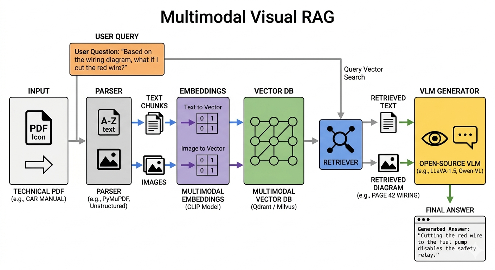

# Multimodal & Agentic RAG System Architecture

## 1. The Core RAG Engine: Multimodal Processing

### The Problem
Traditional chatbots and standard RAG systems operate solely on text. When processing a 500-page engineering manual or a medical textbook, they ignore critical visual context—diagrams, charts, and blueprints. This omission leads to incomplete or inaccurate answers for complex technical queries.

### The Solution: "Visual RAG"
Our system implements a comprehensive "Visual RAG" pipeline:
1. **Document Upload**: Users upload dense, complex PDFs (e.g., schematics, datasets).
2. **Parsing & Extraction**: The system separates text from images, maintaining spatial relationships and metadata.
3. **Multimodal Embedding**: Both text and images are embedded into a unified Multimodal Vector Database.
4. **Contextual Querying**: When asked about a specific diagram, the system retrieves the exact image and surrounding text, feeding both into an advanced Vision-Language Model (VLM) to generate highly accurate, visually-informed answers.

---

## 2. Architecture Overview

---

## 3. Implementation Phases

### Phase 1: Environment & Architecture Planning
- **Data Flow:** PDF Input → Parser → [Text chunks + Images] → Embeddings → Vector DB → Hybrid Retrieval → VLM → Answer
- **Tools Used:** Python, PyMuPDF, Qdrant, OpenRouter API, CLIP, LangGraph.

### Phase 2: PDF Parsing (Splitting Text from Images)
- **Parser Choice:** `PyMuPDF` (fitz) is used for its high reliability in extracting both text blocks and embedded images while preserving page numbers and bounding boxes.
- **Contextual Extraction:** Text is extracted logically and tagged with metadata. Images are saved and tagged with their location. Capturing surrounding text as "context text" for images significantly improves retrieval accuracy.

### Phase 3: The Embedding Pipeline
- **Text Embeddings:** Text chunks are vectorized using standard text embedding models (`sentence-transformers/all-MiniLM-L6-v2`).
- **Image Embeddings (CLIP):** OpenAI's **CLIP** model is utilized to embed text and images into the *same vector space*. This allows text queries (e.g., "wiring diagram") to match directly with relevant image vectors.

### Phase 4: Vector Database Management
- **Database Choice:** **Qdrant** (via Docker) manages the vector storage.
- **Dual Collections:** Separate collections are maintained for `text_chunks` and `image_chunks` due to differing vector dimensions.

### Phase 5: Hybrid Retrieval Logic
- **Parallel Searching:** Queries trigger two parallel searches:
  1. Text-based query embedding → searches `text_chunks`.
  2. CLIP-based query embedding → searches `image_chunks`.
- **Context Assembly:** Top results are merged into a unified multimodal prompt context.

### Phase 6: VLM Inference
- **Model Deployment:** Inference is handled via the **OpenRouter API**, enabling access to state-of-the-art models (GPT-4o, LLaVA, Qwen-VL) without massive local GPU requirements.
- **Prompt Engineering:** The VLM receives explicit instructions, text context, and base64-encoded images to act as a technical manual assistant.

---

## 4. Advanced System: Agentic AI Integration

To elevate the system beyond simple retrieval and answering, we integrated **Agentic AI** frameworks to allow the system to reason, use tools, and make multi-step decisions.

### ReAct Framework (Reason + Act)
The Agent uses a ReAct pattern to break down complex user queries. Instead of a single retrieval step, the agent can:
- **Reason**: Determine if it needs to search the database, analyze an image, or perform a calculation.
- **Act**: Execute specific tools (e.g., querying Qdrant, running a Python script).
- **Observe**: Evaluate the tool's output and decide if the answer is complete or if further action is required.

### LangGraph Orchestration
For complex, multi-agent workflows, **LangGraph** orchestrates stateful, cyclic processes. This allows for deep, iterative document analysis where agents can collaborate, maintain state across interactions, and recursively refine their findings before presenting the final answer to the user.
